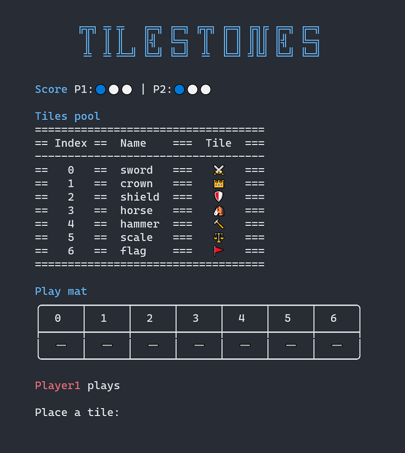

# Tilestones

<p style="text-align:center">

</p>

A fangame based on the Tellstones King's Gambit board game.

## Install

1. Download [node.js](https://nodejs.org/) and install it
2. Download the [repo](https://github.com/rjpiva/tilestones/archive/refs/heads/master.zip)
3. In the extracted folder, open the command prompt and run the following command

```shell
npm install && npm run start
```

4. Have fun! 

Alternatively, you can always download the [latest compiled version](https://github.com/rjpiva/tilestones/releases/latest)


## Use it as a module

You can also embed the game in your project

### CommonJS
```javascript
const tilestones = require('tilestones');
tilestones.play(); 
```

### ES Modules
```javascript
import tilestones from 'tilestones'
tilestones.play(); 
```

## Game Rules
The game rules are available at [tellstones.com](https://tellstones.com/). For a straightforward introduction to the game, you can check out [Ryan's tutorial](https://youtu.be/p0lol1-Xt3Q)

🎲Pro tip: you can acquire the physical board game at [tellstones.com](https://tellstones.com)